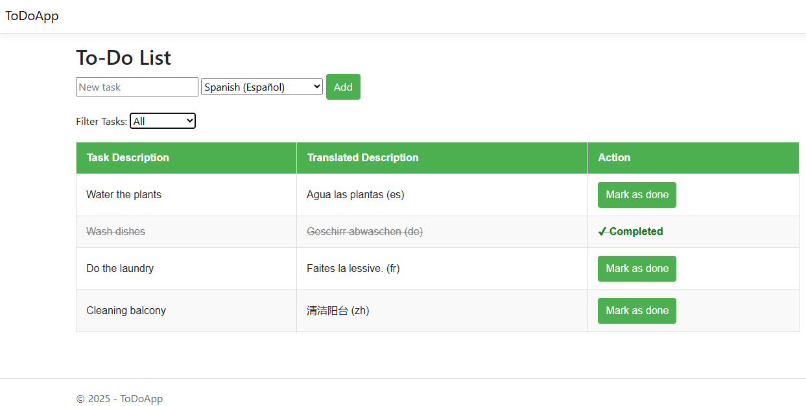

# 📝 ToDoApp

A simple multilingual To-Do list application built with **ASP.NET Core MVC** and **Entity Framework Core**. Tasks can be translated into various languages using the MyMemory translation API.

---

## 🚀 Features

- ✅ Add new to-do items with descriptions
- 🌍 Translate tasks into multiple languages
- ✔️ Mark tasks as completed
- 🔍 Filter tasks by All, Completed, or Incomplete
- 🎨 Razor-based UI with responsive table styling

---

## 📸 Screenshots




---

## 🛠️ Tech Stack

- ASP.NET Core MVC
- Entity Framework Core (SQLite or SQL Server)
- MyMemory Translation API
- Razor Views
- Bootstrap (optional for UI)

---

## ⚙️ Setup Instructions

### 1. Clone the Repository, Restore Dependencies, Apply Migrations and Update Database, Run the App

```bash
git clone https://github.com/Xolani-Dev99/ToDoApp.git
cd ToDoApp

dotnet restore

dotnet ef database update

dotnet run


